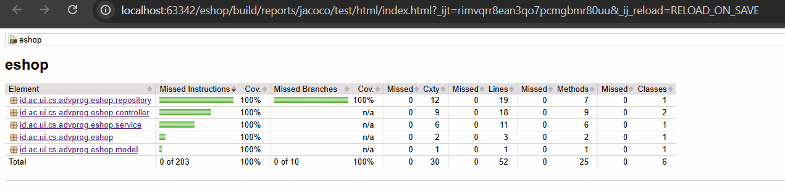

# Module 1
## Reflection 1

Setelah mengimplementasikan fitur Edit dan Delete, saya mencoba menerapkan beberapa standar pengkodean yang telah dipelajari. Pertama, saya menggunakan penamaan yang bermakna untuk setiap variabel dan method, sehingga kode lebih mudah dibaca tanpa perlu banyak komentar. Kedua, saya menerapkan prinsip Small Functions, di mana setiap method hanya bertanggung jawab pada satu tugas tertentu (misalnya, satu method khusus untuk mencari ID dan satu method khusus untuk menghapus data). Dari sisi keamanan, saya sudah menerapkan Secure Coding dengan memastikan bahwa interaksi data dilakukan melalui layer Service, sehingga Controller tidak langsung menyentuh logika penyimpanan data di Repository.

Meskipun fitur sudah berjalan, saya menemukan beberapa hal yang masih bisa ditingkatkan. Salah satunya adalah cara saya menangani UUID. Saat ini, ID dibuat secara manual di sisi client atau controller, yang mana sebenarnya lebih aman jika diotomatisasi secara unik di sisi model atau repository menggunakan `java.util.UUID` untuk mencegah duplikasi ID. Selain itu, saya merasa Error Handling saya masih perlu diperbaiki. Saat ini aplikasi mungkin akan bingung jika pengguna mencoba mengakses ID yang tidak ada melalui URL. Rencana perbaikan saya adalah menambahkan validasi yang lebih kuat dan mengembalikan halaman error yang lebih informatif jika data tidak ditemukan, sehingga aplikasi menjadi lebih tahan terhadap input yang tidak terduga.

## Reflection 2

1. Setelah mempraktikkan pembuatan unit test, saya merasa lebih yakin dengan kualitas kode yang saya hasilkan. Unit test berfungsi sebagai pengaman yang memastikan bahwa perubahan pada satu bagian kode tidak akan merusak fungsi lainnya secara tidak sengaja. Mengenai jumlah test, idealnya sebuah kelas memiliki jumlah pengujian yang cukup untuk mencakup semua skenario fungsionalitasnya, baik skenario sukses maupun skenario gagal. Saya juga mempelajari tentang code coverage, yaitu metrik untuk melihat seberapa banyak baris kode yang telah dijalankan oleh test. Namun, saya memahami bahwa code coverage 100% tidak menjamin kode bebas dari bug. Metrik ini hanya menunjukkan bahwa setiap baris kode sudah pernah dieksekusi selama pengujian, tetapi belum tentu semua kombinasi logika atau edge case telah diuji dengan benar.

2. Apabila saya membuat kelas functional test baru dengan menyalin prosedur setup dan variabel yang sama persis dari kelas sebelumnya, hal ini akan menurunkan kualitas kode saya. Masalah utama yang muncul adalah duplikasi kode yang melanggar prinsip Don't Repeat Yourself (DRY). Dampaknya adalah kode menjadi sulit untuk dirawat. Jika terdapat perubahan konfigurasi, seperti perubahan port server, saya harus memperbaruinya secara manual di setiap file test. Hal ini membuat kode tidak efisien dan rentan terhadap kesalahan manusia. Untuk memperbaikinya, saya perlu melakukan refactoring dengan membuat semacam base class yang berisi prosedur setup umum. Dengan begitu, kelas-kelas test lainnya cukup melakukan extends ke kelas induk tersebut agar kode menjadi lebih bersih, ringkas, dan mudah untuk dikelola.

# Module 2

1. Selama mengerjakan exercise ini, saya memperbaiki beberapa code quality issue berdasarkan hasil analisis dari SonarCloud. Salah satu perbaikan utama yang saya lakukan adalah merapikan bagian dependencies pada file build.gradle. Sebelumnya, struktur dependencies belum terorganisir dengan baik dan beberapa versi library dituliskan secara langsung atau hard code di dalam deklarasi dependency. Saya kemudian mengelompokkan dependencies berdasarkan sumber dan fungsinya, seperti Web & UI, Development Tools, Unit & Integration Testing, serta Browser Testing. Selain itu, saya mengganti penulisan versi yang sebelumnya hard code menjadi menggunakan variabel, misalnya untuk Mockito. Dengan cara ini, jika ingin mengganti versi library, cukup mengubah satu variabel saja. Perbaikan ini berkaitan dengan prinsip Clean Code, terutama dalam hal keterbacaan dan maintainability, karena konfigurasi menjadi lebih rapi, konsisten, dan mudah dipelihara. Secara tidak langsung, pengelompokan ini juga mencerminkan prinsip pemisahan tanggung jawab agar setiap bagian konfigurasi memiliki fungsi yang jelas.

2. Menurut saya, implementasi yang saya buat sudah memenuhi konsep Continuous Integration dan Continuous Deployment. Setiap kali saya melakukan push ke branch main, GitHub Actions secara otomatis menjalankan proses build sehingga setiap perubahan kode langsung divalidasi. Setelah proses build berhasil, Koyeb secara otomatis melakukan deployment ke server tanpa perlu tindakan manual. Selain itu, pipeline juga menjalankan analisis kualitas kode dan pemeriksaan keamanan. Dengan adanya proses build, analisis, dan deployment yang berjalan otomatis dalam satu alur, saya merasa implementasi ini sudah sesuai dengan definisi CI/CD yang saya pelajari.

URL aplikasi saya dideploy: https://only-tamera-b-seanmarcellomaheron-2406401792-29792e4b.koyeb.app/

Terakhir, terlampir coverage unit-test saya :3

# Module 3

### 1) Explain what principles you apply to your project!
* **SRP (Single Responsibility Principle)**: Memisahkan tanggung jawab pembuatan ID (UUID) dari CarRepository ke dalam CarServiceImpl. Hal ini memastikan bahwa CarRepository hanya bertanggung jawab pada penyimpanan data, sementara logika bisnis seperti penomoran atau identifikasi berada di layer Service
* **OCP (Open-Closed Principle):** Memindahkan logika update ke model Car, sehingga CarRepository tertutup dari modifikasi tetapi terbuka untuk ekstensi jika ada atribut baru.
* **LSP (Liskov Substitution Principle):** Menghapus *inheritance* `CarController extends ProductController` karena *subclass* harus bisa menggantikan *base class* tanpa merusak kebenaran program.
* **ISP (Interface Segregation Principle):** Tidak ada perubahan karena interface CarService dan CarRepository dirancang spesifik hanya berisi metode operasi CRUD yang sepenuhnya dibutuhkan dan digunakan oleh kliennya, sehingga tidak ada klien yang dipaksa untuk bergantung pada ataupun mengimplementasikan antarmuka yang tidak relevan.
* **DIP (Dependency Inversion Principle):** Saya membuat interface CarService dan CarRepository. CarController kini bergantung pada abstraksi CarService, dan CarServiceImpl bergantung pada abstraksi CarRepository, bukan pada implementasi konkritnya.

---

### 2) Explain the advantages of applying SOLID principles to your project with examples.
* **Mudah Diuji (*Testing*):** *Class* yang lebih kecil dan fokus (SRP) membutuhkan lebih sedikit *test case* dan mempermudah isolasi komponen.
* **Ketergantungan Rendah (*Lower Coupling*):** Bergantung pada *interface* (DIP) dan memisahkan tanggung jawab (SRP) meminimalkan dampak berantai (*ripple effect*) saat ada modifikasi.
* **Mudah Dikembangkan (*Extensibility*):** Kode menjadi fleksibel untuk ditambah fiturnya tanpa harus membongkar dan berisiko merusak kode lama yang sudah stabil (OCP).

---

### 3) Explain the disadvantages of not applying SOLID principles to your project with examples.
* **Kode Menjadi Rapuh (*Fragile*):** Tanpa SRP dan OCP, mengubah satu fitur dapat secara tidak sengaja mematahkan fitur lain karena logika yang saling tumpang tindih.
* **Sulit Dipahami dan Dikelola:** *Class* yang menanggung banyak tugas (monolitik) sangat sulit dinavigasi dan membuat *developer* takut untuk melakukan perubahan.
* **Pengujian Terhambat:** Kode yang saling terikat erat (*tightly coupled*) tanpa abstraksi antarmuka (melanggar DIP) tidak bisa diisolasi, sehingga *unit testing* menjadi sangat sulit dilakukan.